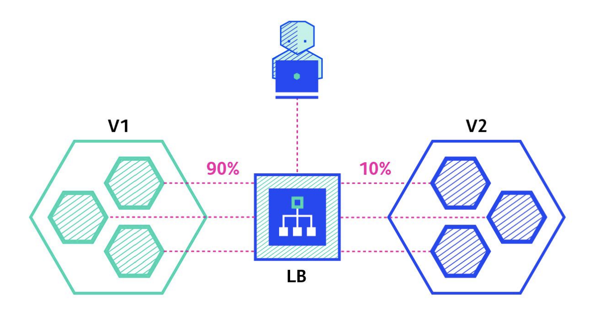

# canary-deployment



***Click this link for reference***:- https://kubernetes.github.io/ingress-nginx/examples/canary/


**NOTE** pls replace 68.183.247.104 ip to your INGRESS_CONTROLLER_IP 

```
for i in $(seq 1 10); do curl -s --resolve k8s.mydomain.com:80:68.183.247.104 k8s.mydomain.com | grep "Hostname"; done
```

#### OUTPUT


You will get the following output showing that your canary setup is working as expected:

```
Hostname: production-5c5f65d859-phqzc
Hostname: canary-6697778457-zkfjf
Hostname: canary-6697778457-zkfjf
Hostname: production-5c5f65d859-phqzc
Hostname: canary-6697778457-zkfjf
Hostname: production-5c5f65d859-phqzc
Hostname: production-5c5f65d859-phqzc
Hostname: production-5c5f65d859-phqzc
Hostname: canary-6697778457-zkfjf
Hostname: production-5c5f65d859-phqzc

```